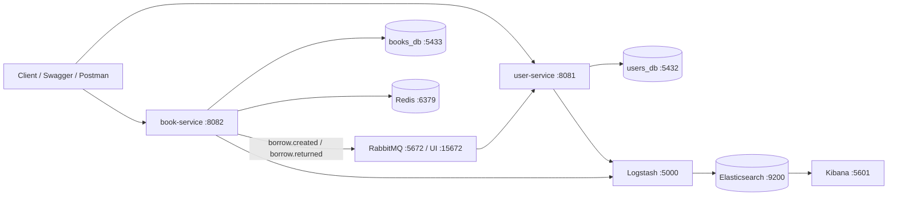

# LibraryHub

LibraryHub istifadəçi, kitab kataloqu və kitabların ödünc verilməsi prosesini idarə edən Spring Boot mikroservis layihəsidir. Sistem iki müstəqil servis, iki PostgreSQL verilənlər bazası, RabbitMQ və Redis-dən ibarətdir.

## Arxitektura



- `user-service` qeydiyyat, login, JWT yaradılması, profil və borrow tarixçəsini idarə edir.
- `book-service` kateqoriya, kitab kataloqu və borrow əməliyyatlarını idarə edir.
- Servislər arasında birbaşa REST çağırışı yoxdur.
- Borrow hadisələri RabbitMQ vasitəsilə asinxron ötürülür.
- Hər servisin ayrıca PostgreSQL bazası var.

## Texnologiyalar

- Java 25
- Spring Boot 4.1
- Spring Data JPA və Hibernate
- Spring Security və JWT
- PostgreSQL 17
- Liquibase
- RabbitMQ
- Spring Cache və Redis
- Spring AOP
- MapStruct və Lombok
- Spock Framework və Groovy
- Swagger / OpenAPI 3
- Docker və Docker Compose

## Servislər və portlar

| Komponent | Port | Təyinat |
|---|---:|---|
| user-service | 8081 | İstifadəçi və autentifikasiya API-si |
| book-service | 8082 | Kitab, kateqoriya və borrow API-si |
| users PostgreSQL | 5432 | `users_db` |
| books PostgreSQL | 5433 | `books_db` |
| RabbitMQ | 5672 | AMQP bağlantısı |
| RabbitMQ Management | 15672 | Broker idarəetmə paneli |
| Redis | 6379 | Kitab cache-i |
| Logstash | 5000 | Strukturlaşdırılmış log qəbulu |
| Logstash API | 9600 | Logstash monitorinq API-si |
| Elasticsearch | 9200 | Mərkəzləşdirilmiş log storage və axtarış |
| Kibana | 5601 | Logların vizuallaşdırılması |

## İlkin tələblər

Tam Docker mühiti üçün:

- Docker Desktop
- Docker Compose 2.x

Servisləri lokal işə salmaq üçün əlavə olaraq:

- JDK 25

Gradle ayrıca quraşdırılmalı deyil; hər iki modulda Gradle Wrapper var.

## Environment dəyişənləri

Layihənin kökündə `.env` faylı yaradın:

```dotenv
POSTGRES_USER=postgres
POSTGRES_PASSWORD=change-this-password
RABBITMQ_USER=library
RABBITMQ_PASSWORD=change-this-password
JWT_SECRET=replace-with-at-least-32-byte-secret-key
```

`JWT_SECRET` hər iki servis üçün eyni olmalıdır: token `user-service` tərəfindən yaradılır, `book-service` tərəfindən yoxlanılır.

> `.env` daxilindəki real DB, RabbitMQ və JWT məlumatlarını production repository-sinə commit etməyin. Production mühitində secret manager və ya deployment platformasının secret mexanizmindən istifadə edin.

## Docker ilə işə salma

Layihənin kökündə:

```bash
docker compose up --build -d
```

Servislərin vəziyyətini yoxlamaq:

```bash
docker compose ps
```

Logları izləmək:

```bash
docker compose logs -f user-service book-service
```

Konteynerləri dayandırmaq:

```bash
docker compose down
```

Verilənlər bazası volume-ları daxil olmaqla tam sıfırlamaq:

```bash
docker compose down -v
```

> `down -v` bütün lokal database məlumatlarını silir.

Docker Compose əvvəlcə PostgreSQL, RabbitMQ və Redis healthcheck-lərinin uğurlu olmasını gözləyir, sonra tətbiq servislərini başladır. Liquibase migration-ları servislər açılarkən avtomatik tətbiq edilir.

## Lokal development

Yalnız infrastrukturu Docker-də qaldırmaq üçün:

```bash
docker compose up -d postgres-users postgres-books rabbitmq redis
```

Sonra hər servisi ayrıca başladın.

Windows:

```powershell
cd user-service
.\gradlew.bat bootRun
```

Başqa terminalda:

```powershell
cd book-service
.\gradlew.bat bootRun
```

Linux/macOS:

```bash
cd user-service
./gradlew bootRun
```

```bash
cd book-service
./gradlew bootRun
```

Lokal servislərin DB və RabbitMQ credential-ları `.env` dəyərlərindən fərqlidirsə, uyğun `SPRING_DATASOURCE_*`, `SPRING_RABBITMQ_*` və `JWT_SECRET` environment dəyişənlərini terminalda təyin edin.

## Swagger

Servislər başladıqdan sonra OpenAPI interfeysləri:

- user-service: [http://localhost:8081/swagger-ui/index.html](http://localhost:8081/swagger-ui/index.html)
- book-service: [http://localhost:8082/swagger-ui/index.html](http://localhost:8082/swagger-ui/index.html)

RabbitMQ Management UI:

- [http://localhost:15672](http://localhost:15672)
- İstifadəçi adı və parol `.env` daxilindəki `RABBITMQ_USER` və `RABBITMQ_PASSWORD` dəyərləridir.

## Autentifikasiya

Qeydiyyat:

```http
POST http://localhost:8081/api/auth/register
Content-Type: application/json
```

```json
{
  "username": "johndoe",
  "email": "john@example.com",
  "password": "Secret123!",
  "fullName": "John Doe"
}
```

Login:

```http
POST http://localhost:8081/api/auth/login
Content-Type: application/json
```

```json
{
  "username": "johndoe",
  "password": "Secret123!"
}
```

Qorunan endpointlərə token göndərmək üçün:

```http
Authorization: Bearer <accessToken>
```

Yeni qeydiyyatlar həmişə `USER` rolu ilə yaradılır. `ADMIN` rolu verilənlər bazasında manual təyin edilir:

```sql
UPDATE users
SET role = 'ADMIN'
WHERE username = 'johndoe';
```

## API endpointləri

### user-service

Base URL: `http://localhost:8081/api`

| Metod | Endpoint | İcazə | Açıqlama |
|---|---|---|---|
| POST | `/auth/register` | Public | Yeni istifadəçi qeydiyyatı |
| POST | `/auth/login` | Public | Login və JWT alınması |
| GET | `/users/me` | USER/ADMIN | Cari profil |
| PUT | `/users/me` | USER/ADMIN | Profilin yenilənməsi |
| GET | `/users/me/borrows` | USER/ADMIN | Cari istifadəçinin borrow tarixçəsi |
| GET | `/users` | ADMIN | Pageable istifadəçi siyahısı |
| GET | `/users/{id}` | ADMIN | İstifadəçi detalı |
| DELETE | `/users/{id}` | ADMIN | İstifadəçinin soft delete edilməsi |

### book-service — kateqoriyalar

Base URL: `http://localhost:8082/api`

| Metod | Endpoint | İcazə | Açıqlama |
|---|---|---|---|
| GET | `/categories` | Public | Kateqoriya siyahısı |
| GET | `/categories/{id}` | Public | Kateqoriya detalı |
| POST | `/categories` | ADMIN | Kateqoriya yaratmaq |
| PUT | `/categories/{id}` | ADMIN | Kateqoriyanı yeniləmək |
| DELETE | `/categories/{id}` | ADMIN | Kateqoriyanı silmək |

Kitab tərəfindən istifadə edilən kateqoriya silinə bilməz və API `409 Conflict` qaytarır. Kateqoriya yenilənəndə book cache təmizlənir.

### book-service — kitablar

| Metod | Endpoint | İcazə | Açıqlama |
|---|---|---|---|
| GET | `/books` | Public | Pageable və filterli kitab siyahısı |
| GET | `/books/{id}` | Public | Kitab detalı |
| GET | `/books/search?keyword=x` | Public | Ad və müəllif üzrə axtarış |
| POST | `/books` | ADMIN | Kitab yaratmaq |
| PUT | `/books/{id}` | ADMIN | Kitabı yeniləmək |
| PATCH | `/books/{id}/activate` | ADMIN | Deaktiv kitabı yenidən aktivləşdirmək |
| DELETE | `/books/{id}` | ADMIN | Kitabın soft delete edilməsi |

Siyahı nümunəsi:

```http
GET /api/books?page=0&size=10&sort=title,asc&categoryId=1&author=Orwell
```

### book-service — borrow

| Metod | Endpoint | İcazə | Açıqlama |
|---|---|---|---|
| POST | `/borrows` | USER/ADMIN | Kitab götürmək |
| POST | `/borrows/{id}/return` | USER/ADMIN | Kitabı qaytarmaq |
| GET | `/borrows/my` | USER/ADMIN | Cari istifadəçinin borrow siyahısı |
| GET | `/borrows` | ADMIN | Bütün borrow qeydləri |
| GET | `/borrows/overdue` | ADMIN | Gecikmiş borrow qeydləri |

Borrow request:

```json
{
  "bookId": 1
}
```

Bir istifadəçi eyni kitabı eyni vaxtda yalnız bir dəfə götürə bilər. Mövcud nüsxə olmadıqda və ya kitab artıq istifadəçidə olduqda API `409 Conflict` qaytarır.

## RabbitMQ event axını

- Exchange: `borrow.exchange`
- Routing key-lər: `borrow.created`, `borrow.returned`
- Consumer queue: `borrow.queue`
- Dead-letter exchange: `borrow.dead.exchange`
- Dead-letter queue: `borrow.dead.queue`

`book-service` borrow transaction commit olduqdan sonra event göndərir. `user-service` event-i qəbul edərək `borrow_histories` cədvəlini yeniləyir. Təkrar `BORROWED` event-ləri `borrowId` vasitəsilə idempotent emal edilir.

Emal edilməyən dead-letter mesajları `user-service` tərəfindən hər 5 dəqiqədən bir maksimum üç dəfə yenidən göndərilir.

## Cache və scheduled task-lar

- Kitab detail, siyahı və axtarış nəticələri Redis-də saxlanılır.
- Cache TTL: 10 dəqiqə.
- Kitab və kateqoriya dəyişiklikləri book cache-i təmizləyir.
- `book-service` hər gün saat `00:00`-da vaxtı keçmiş borrow qeydlərini `OVERDUE` edir.
- `user-service` hər bazar ertəsi saat `09:00`-da 90 gündən çox aktiv olmayan istifadəçiləri loglayır.
- Scheduler-lər `Asia/Baku` timezone-u ilə işləyir.

## ELK log monitorinqi

Docker Compose Elasticsearch, Logstash və Kibana komponentlərini eyni `8.17.3` versiyası ilə başladır. Hər iki Spring Boot servisi `elk` profili aktiv olduqda logları JSON formatında TCP üzərindən Logstash-a göndərir. Servislər Logstash pipeline-ı sağlam olduqdan sonra başlayır; `library-hub-*` indeks şablonu isə lokal single-node cluster üçün replica sayını avtomatik `0` təyin edir.

- Elasticsearch: [http://localhost:9200](http://localhost:9200)
- Kibana: [http://localhost:5601](http://localhost:5601)
- Logstash TCP input: `localhost:5000`
- Logstash API: [http://localhost:9600](http://localhost:9600)

Log indeksləri servis və tarix üzrə yaradılır:

```text
library-hub-user-service-YYYY.MM.dd
library-hub-book-service-YYYY.MM.dd
```

Kibana-da ilk data view yaratmaq üçün:

1. [http://localhost:5601](http://localhost:5601) ünvanını açın.
2. `Stack Management` → `Data Views` bölməsinə keçin.
3. Index pattern kimi `library-hub-*` daxil edin.
4. Timestamp field kimi `@timestamp` seçin.
5. `Discover` bölməsində logları servis, level, logger və message üzrə filterləyin.

Yalnız ELK komponentlərini və tətbiq servislərini yenidən başlatmaq:

```bash
docker compose up -d elasticsearch logstash kibana
docker compose up --build -d user-service book-service
```

ELK loglarını yoxlamaq:

```bash
docker compose logs -f elasticsearch logstash kibana
```

Elasticsearch indekslərini yoxlamaq:

```bash
curl http://localhost:9200/_cat/indices?v
```

ELK lokal development konfiqurasiyasında Elasticsearch security söndürülüb və ELK portları yalnız `127.0.0.1` üzərindən açılıb. Bu konfiqurasiyanı internetə açıq production mühitində olduğu kimi istifadə etməyin.

## Testlər

Windows:

```powershell
cd user-service
.\gradlew.bat test
```

```powershell
cd book-service
.\gradlew.bat test
```

Linux/macOS:

```bash
cd user-service && ./gradlew test
cd ../book-service && ./gradlew test
```

Unit testlər Spock-un mock mexanizmi və `given-when-then` strukturu ilə yazılıb. Test report-ları modul daxilində `build/reports/tests/test/index.html` ünvanında yaranır.

## Layihə strukturu

```text
library-hub/
├── docker-compose.yml
├── user-service/
│   ├── Dockerfile
│   ├── build.gradle
│   └── src/
│       ├── main/
│       └── test/
└── book-service/
    ├── Dockerfile
    ├── build.gradle
    └── src/
        ├── main/
        └── test/
```

Hər modul daxilində controller, service, repository, entity, DTO, mapper, exception, config, AOP və scheduler paketləri ayrıdır. Database dəyişiklikləri `src/main/resources/db/changelog` daxilində Liquibase tərəfindən idarə olunur.

## Tez-tez rast gəlinən problemlər

### Port artıq istifadə olunur

`5432`, `5433`, `5672`, `6379`, `8081`, `8082` və ya `15672` portunu istifadə edən prosesi dayandırın və ya `docker-compose.yml` daxilində host portunu dəyişin.

### Servis database-ə qoşulmur

```bash
docker compose ps
docker compose logs postgres-users postgres-books
```

PostgreSQL healthcheck tamamlanmadan tətbiq servisləri başlamır.

### RabbitMQ authentication xətası

Compose və tətbiq servislərində eyni `RABBITMQ_USER` və `RABBITMQ_PASSWORD` istifadə edildiyini yoxlayın. Credential dəyişdikdən sonra brokeri yenidən yaradın:

```bash
docker compose up -d --force-recreate rabbitmq user-service book-service
```

### Tam lokal sıfırlama

```bash
docker compose down -v
docker compose up --build -d
```

Bu əməliyyat hər iki PostgreSQL bazasındakı lokal məlumatları silir.
